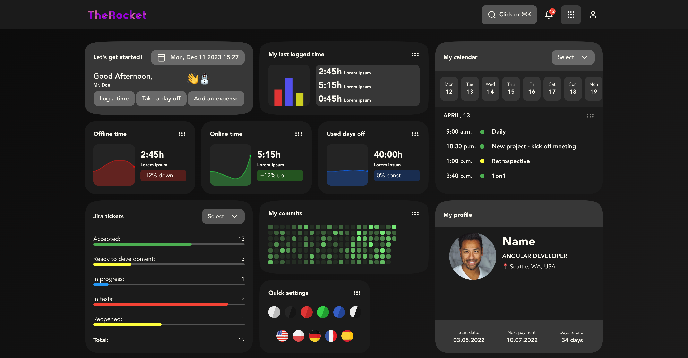
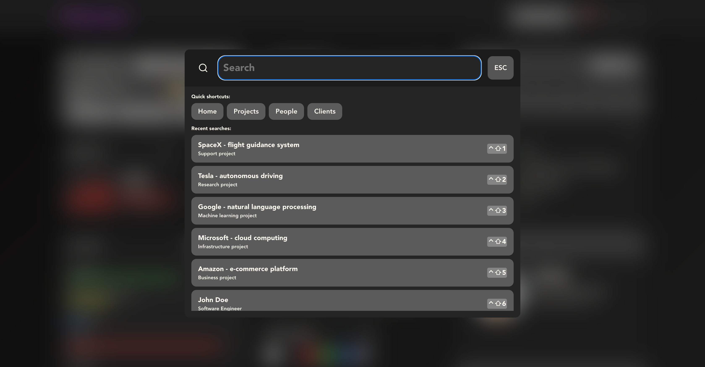

# Modern Dashboard

It is a demo application that shows how to build a modern web application with Angular 16 and NestJS. This project is not an actual application solving any particular business problem. Instead, it is a blueprint that can be used to build an application. For now, it shows how to style the application using the atomic design methodology and how to configure the NX monorepo.

## Purpose

To learn the Angular 16 and NestJS frameworks and build a modern application with cutting-edge technologies and techniques:

- ✅ using the latest Angular 16 features (standalone components, Signal, etc.),
- ✅ using the latest NestJS features (GraphQL, etc.),
- ✅ using the docker containers to develop and run the application,
- ❌ using the MongoDB database with Change Streams,
- ❌ using the .env files to store the secrets,
- ❌ using the CQRS to process the data in the spirit of DDD,
- ✅ using the atomic design methodology to build the UI,
- ❌ using the Storybook to present and test the UI components,
- ❌ using real-time communication with GraphQL subscriptions,
- ❌ using JWT to authenticate the user,
- ❌ using Jest and Angular Testing Library to test the Angular components,
- ✅ using Nx to manage the mono repo (to share code between the front- and back-end, splitting the responsibilities into apps and libs, marking them by scopes and tags).

## Demo

A live demo is available at [https://modern-dashboard-ivory.vercel.app/](https://modern-dashboard-ivory.vercel.app/).

## What does it look like?

Current dashboard:

- does not use actual data,
- does not allow to change the language,
- does not support mobile views (due to the `desktop first approach),
- allows you to change the color theme.

## Design style

The application follows the **flat design** style. The main characteristics are:

- avoiding the shadows to highlight the hierarchy, e.g., modal windows (because they introduce a 3rd dimension),
- playing with the blurs and hues of the colors to show the hierarchy.

## Used technologies

- 🎁 **Repository:** Monorepo with NX
- 🧰 **Frameworks:** Angular 16, NestJS
- 🛠️ **Tools:** yarn, eslint, prettier, husky, conventional commits, storybook, docker, graphql, apollo, chart.js
- 🎨 **Styling:** scss, css variables, BEM notation, lucide icons, smooth-corners
- 🧪 **Testing:** cypress, jest
- ☁️ **Database:** MongoDB with Change Streams, typeORM
- 💎 **Others:** desktop first approach, progressive web app, atomic design

## Storybook

The Storybook is a sandbox for components used in the application. It groups the into three sections, following the **atomic design** approach:

- atoms (e.g., single buttons or input fields),
- molecules (e.g., login form consisting of input fields and a submit button),
- organisms (e.g., most complex views, like login modal window using login form and other molecules).

To start the Storybook:

1. Type and run: `yarn storybook`.
2. Open `http://localhost:4004` in your browser to see the storybook.

## How to run

There are two ways to start a project:

- using a classic Node.js environment installed on the local machine,
- using a development container (the `devcontainer.json` file in the repo).

The classic way:

1. Install [node.js](https://nodejs.org/en/download/).
2. Install [yarn](https://classic.yarnpkg.com/en/docs/install).
3. Clone the repository.
4. Type and run: `yarn` in the root directory.
5. Type and run: `yarn dev` in the root directory.
6. Open `http://localhost:4200` in your browser to see the frontend app.
7. Open `http://localhost:3333` in your browser to see the backend app.

The development container way:

1. Install [VS Code](https://code.visualstudio.com/).
2. Install and run [Docker](https://www.docker.com/products/docker-desktop).
3. Install a VS Code [Remote - Containers](https://marketplace.visualstudio.com/items?itemName=ms-vscode-remote.remote-containers) extension.
4. Clone the repository.
5. Open the repository in VS Code.
6. Click the `><` (Open a Remove Window) button in the bottom left corner of the VS Code window.
7. Select `Reopen in Container`.
8. Wait for the container to start.
9. Open a terminal in VS Code (it will be automatically connected to the container's shell).
10. Type and run: `yarn` in the root directory.
11. Type and run: `yarn dev` in the root directory.
12. Open `http://localhost:4200` in your browser to see the frontend app.
13. Open `http://localhost:3333` in your browser to see the backend app.
